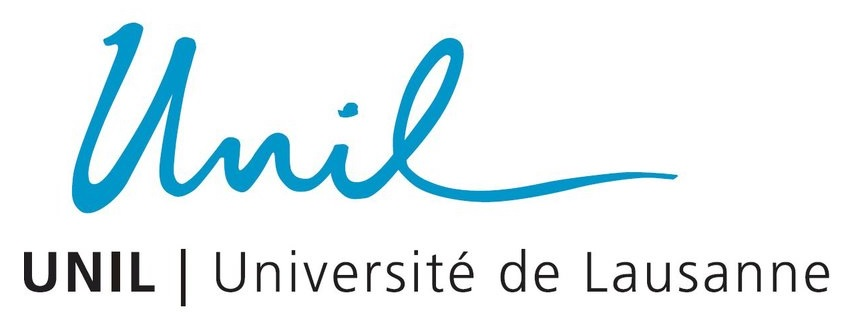
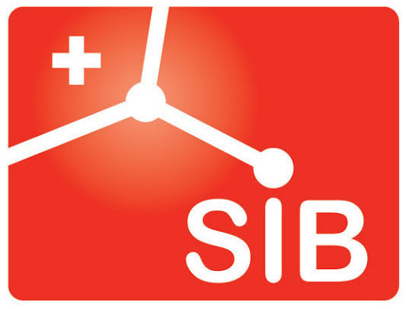

1

2

3

4

<!---
# THORIN
{: .fs-9 .fw-500 }
-->

<!---
**T**arget **H**aplotype **OR**igin **IN**ference version **1.2**
{: .fs-5 }
-->

---

## About

THORIN is a tool for mapping Identify-By-Descent (IBD) and inferring the Parent-of-Origin of alleles.

## News

{: .new }
> **Version `1.2.0` is now available!**
<!--- > See [the CHANGELOG](https://github.com/odelaneau/shapeit5/blob/main/docs/CHANGELOG.md) for details.
-->

## Citation

If you use THORIN in your research work, please cite the following paper:

Hofmeister RJ, et al. [Parent-of-Origin inference and its role in the genetic architecture of complex traits: evidence from ∼220,000 individuals](https://www.medrxiv.org/content/10.1101/2024.12.03.24318392v1)

---

[Get started now](#getting-started){: .btn .btn-primary .fs-5 .mb-4 .mb-md-0 .mr-2 .mx-auto }
[View source code on GitHub](https://github.com/rjhfmstr/thorin){: .btn .fs-5 .mb-4 .mb-md-0 }

---

---

## Getting started

- [See documentation](https://rjhfmstr.github.io/THORIN/docs/documentation)

---

## About the project

THORIN is developed by Robin Hofmeister, Theo Cavinato and Olivier Delaneau.

### License

THORIN is distributed with [MIT license](https://github.com/RJHFMSTR/THORIN/blob/main/LICENSE).

### Organisations

  

  

  

### Contributing

THORIN is an open source project and we very much welcome new contributors. When contributing to our repository, please first discuss the change you wish to make via issue,
email, or any other method with the owners of this repository before making a change.
#### Thank you to the contributors of THORIN!

<ul class="list-style-none">

  <li class="d-inline-block mr-1">
     
  </li>

</ul>

---

We thank the [Just the Docs](https://github.com/just-the-docs/just-the-docs) developers, who made this awesome theme for Jekyll.

